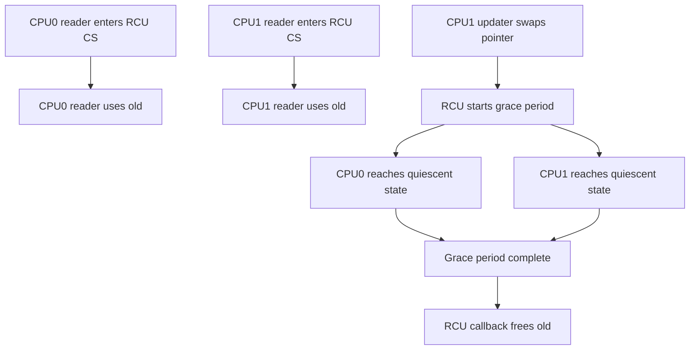

# f8850bc3986562f79619: RCU stalls and hrtimer catch-up storms

This note documents the discussion about how a TAPRIO hrtimer catch-up storm can lead to RCU stall warnings, and provides background on RCU grace periods and stall detection.

## 1) How a hrtimer catch-up storm triggers an RCU stall

- In software TAPRIO, `advance_sched()` is an hrtimer callback that advances gate entries.
- With extremely small intervals, the callback can rearm the timer into the past.
- The timer then fires again immediately, creating a tight loop in hardirq/softirq context.
- That loop can monopolize CPU time and prevent the CPU from reaching quiescent states.
- RCU waits for quiescent states on all CPUs during a grace period; if one CPU does not report one in time, RCU emits a stall warning (for example `rcu_preempt detected stalls`).

## 2) Why RCU tracks grace periods

- RCU (Read-Copy-Update) lets readers run without locks while writers update shared structures by publishing new versions.
- A grace period is the time RCU waits until all CPUs have passed through a quiescent state, which guarantees that all pre-existing readers are done.
- Only after the grace period ends is it safe to reclaim or free the old data version.

## 3) High-level implementation overview

- Readers mark read-side critical sections with `rcu_read_lock()` and `rcu_read_unlock()`.
- Updaters replace pointers with `rcu_assign_pointer()` and later free old data via `call_rcu()`.
- Per-CPU RCU state tracks whether each CPU has reported a quiescent state in the current grace period.
- A global grace period coordinator (kernel thread or softirq-driven state machine) advances the grace period and wakes up callbacks when safe.

## 3a) More detailed flow with one updater and two readers

Sample setup:

- Shared pointer `p` points to an object.
- Two readers run on CPU0 and CPU1.
- One updater runs on CPU1.

Pseudo code:

```c
// Reader (CPU0)
void reader0(void)
{
	rcu_read_lock();
	obj = rcu_dereference(p);
	use(obj);
	rcu_read_unlock();
}

// Reader (CPU1)
void reader1(void)
{
	rcu_read_lock();
	obj = rcu_dereference(p);
	use(obj);
	rcu_read_unlock();
}

// Updater (CPU1)
void updater(void)
{
	new = alloc();
	old = rcu_dereference(p);
	rcu_assign_pointer(p, new);
	call_rcu(old, free_old_cb);
}
```

CPU and preemption timeline (simplified):

1) CPU0 enters `rcu_read_lock()` and begins using `old`.
2) CPU1 enters `rcu_read_lock()` and also uses `old`.
3) CPU1 runs updater, swaps `p` to `new`, calls `call_rcu(old, ...)`.
4) RCU starts a grace period and waits for all CPUs to reach quiescent states.
5) CPU0 reaches a quiescent point (context switch, user mode, idle, etc). CPU0 is marked as done.
6) CPU1 later reaches a quiescent point. CPU1 is marked as done.
7) Grace period ends, `free_old_cb(old)` runs, and old is reclaimed.

The key is that RCU does not need to block readers. It only waits until every CPU has passed a quiescent state after the update.

Flow diagram (simplified):



## 3b) Where quiescent states come from

- For preemptible RCU, quiescent states are often tied to context switches or explicit RCU accounting points.
- For non-preemptible contexts (hardirq/softirq), a CPU can avoid quiescent states for long periods if it never returns to a point where RCU can observe quiescence.

## 3c) Common questions (from discussion)

- Does reaching a quiescent point mean a CPU called `rcu_read_unlock()`?
	- Not exactly. `rcu_read_unlock()` ends one read-side critical section, but a quiescent state is a point where the CPU is known to be outside *any* RCU read-side critical section (depending on RCU flavor).
- When is `call_rcu(old, free_old_cb)` called?
	- The updater calls it immediately after publishing the new pointer. It just queues the callback and returns.
- Is `call_rcu()` blocked if CPUs have not reached quiescent states?
	- No. The callback is deferred and will run only after the grace period completes.
- What does quiescent point really mean?
	- A moment when the CPU is guaranteed not to be inside any RCU read-side critical section. Common sources are context switches, idle, or user mode for preemptible RCU.

## 3d) How the CPU is known to be out of RCU read-side sections

- RCU keeps per-CPU state indicating whether that CPU has passed a quiescent state in the current grace period.
- The state is updated at well-defined points (for example context switches, idle entry/exit, user-mode entry), where the kernel can safely conclude the CPU is not in an RCU read-side section.
- During a grace period, RCU checks these per-CPU states to decide when all CPUs are done.

## 3f) Hooks and grace-period logic (code references)

- Quiescent-state hooks in the scheduler:
	- `rcu_note_context_switch()` in [kernel/sched/core.c#L6791](https://github.com/torvalds/linux/blob/master/kernel/sched/core.c#L6791)
- Grace-period and quiescent-state reporting:
	- `rcu_gp_kthread()` in [kernel/rcu/tree.c#L2271](https://github.com/torvalds/linux/blob/master/kernel/rcu/tree.c#L2271)
	- `rcu_check_quiescent_state()` in [kernel/rcu/tree.c#L2498](https://github.com/torvalds/linux/blob/master/kernel/rcu/tree.c#L2498)
	- `rcu_report_qs_rdp()` in [kernel/rcu/tree.c#L2443](https://github.com/torvalds/linux/blob/master/kernel/rcu/tree.c#L2443)
	- `rcu_report_qs_rnp()` in [kernel/rcu/tree.c#L2339](https://github.com/torvalds/linux/blob/master/kernel/rcu/tree.c#L2339)
	- `rcu_sched_clock_irq()` in [kernel/rcu/tree.c#L2696](https://github.com/torvalds/linux/blob/master/kernel/rcu/tree.c#L2696)
- Stall timing and warning logic:
	- `rcu_jiffies_till_stall_check()` in [kernel/rcu/tree_stall.h#L111](https://github.com/torvalds/linux/blob/master/kernel/rcu/tree_stall.h#L111)
	- `rcu_cpu_stall_reset()` in [kernel/rcu/tree_stall.h#L190](https://github.com/torvalds/linux/blob/master/kernel/rcu/tree_stall.h#L190)
	- `rcu_stall_kick_kthreads()` in [kernel/rcu/tree_stall.h#L227](https://github.com/torvalds/linux/blob/master/kernel/rcu/tree_stall.h#L227)

## 3g) Summary answer from discussion

- Yes. RCU code is invoked at specific hook points (context switch, idle/user transitions, tick/softirq) to mark quiescent states, and the grace-period logic periodically checks per-CPU state to determine completion or to detect stalls.

## 3e) Typical kernel hooks that report quiescent states

- Context switch paths (scheduler) can report that a CPU passed a quiescent point.
- Idle entry/exit paths report quiescent states.
- Transitions to user mode can count as quiescent points for preemptible RCU.
- RCU also uses periodic accounting (for example from the scheduler tick) to advance grace periods and detect stalls.

## 4) How RCU detects stalls

- RCU periodically checks how long the current grace period has been running.
- If a CPU does not report a quiescent state within the stall timeout, RCU prints a stall warning, typically including the blocked CPU and a stack trace.
- The warning indicates that the CPU is not reaching quiescent states, not necessarily that it is fully idle or 100 percent busy.

## 5) Which CPU runs the detection and at what level

- The grace period and stall detection are coordinated by RCU infrastructure, typically through a per-CPU softirq handler and/or a dedicated kthread (for example `rcu_preempt`/`rcu_sched` kthreads).
- Stall detection itself is not tied to the same CPU that is stalled; another CPU can report the stall and log the warning.
- The problematic CPU is the one that fails to report a quiescent state, often because it is stuck in interrupt/softirq context or in non-preemptible kernel code.

## 6) Key takeaway for this bug

- The TAPRIO timer catch-up storm is a *pathological workload* that keeps a CPU in interrupt context.
- That prevents the CPU from reporting quiescent states, causing RCU to flag a stall even if the root cause is the timer loop, not RCU itself.

## 7) Single-CPU case with a hrtimer storm

- On a single CPU system, a tight hrtimer catch-up storm can starve almost everything, including RCU housekeeping.
- In that case, the system can appear hung, and the usual RCU stall warning may not print because the CPU never gets a chance to run the RCU stall detector.
- If the storm occasionally yields, you may still see RCU warnings, but total CPU starvation can present as a hard hang.
