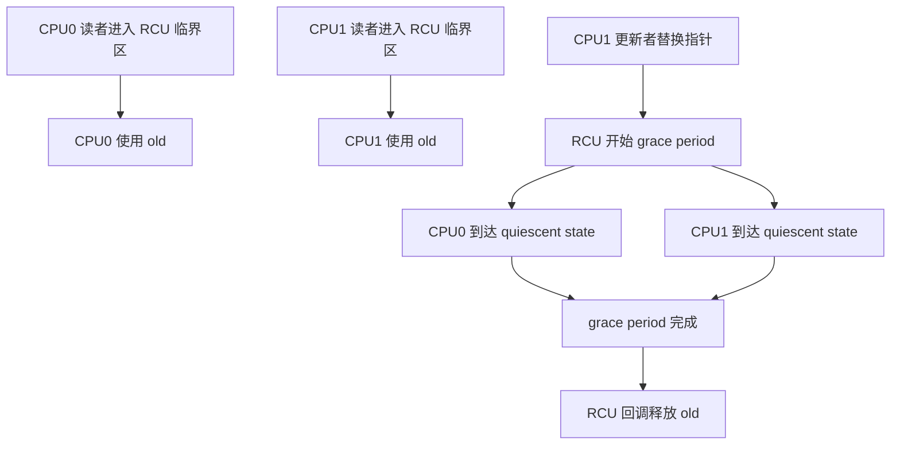

# f8850bc3986562f79619: RCU stall 与 hrtimer 追赶风暴

本文记录 TAPRIO hrtimer 追赶风暴如何引发 RCU stall 警告，并补充 RCU grace period 与 stall 检测的背景说明。

## 1) hrtimer 追赶风暴如何触发 RCU stall

- 在 TAPRIO 软件模式下，`advance_sched()` 是推进门控条目的 hrtimer 回调。
- 当 interval 极小，回调可能把定时器重编程到“过去”的时间点。
- 定时器随即再次触发，形成硬中断/软中断上下文中的紧密循环。
- 该循环可能长期占用 CPU，导致 CPU 无法到达 quiescent states。
- RCU 在 grace period 内等待所有 CPU 报告 quiescent states；若某 CPU 超时未报告，RCU 就会输出 stall 警告（例如 `rcu_preempt detected stalls`）。

## 2) 为什么 RCU 要跟踪 grace periods

- RCU（Read-Copy-Update）允许读路径无锁并发，写者通过发布新版本更新数据结构。
- grace period 是 RCU 等待所有 CPU 进入 quiescent states 的时间段，以保证旧读者已结束。
- 只有 grace period 结束后，旧版本数据才可以安全回收。

## 3) 实现概要（高层）

- 读者使用 `rcu_read_lock()`/`rcu_read_unlock()` 标记读侧临界区。
- 更新者通过 `rcu_assign_pointer()` 发布新指针，并用 `call_rcu()` 延迟释放旧数据。
- 每 CPU 的 RCU 状态跟踪该 CPU 是否在当前 grace period 内报告过 quiescent state。
- 全局协调者（kthread 或 softirq 驱动的状态机）推进 grace period 并在安全时触发回调。

## 3a) 更细的流程示例（一个更新者 + 两个读者）

示例设定：

- 共享指针 `p` 指向一个对象。
- 两个读者运行在 CPU0 和 CPU1。
- 一个更新者运行在 CPU1。

伪代码：

```c
// 读者 (CPU0)
void reader0(void)
{
	rcu_read_lock();
	obj = rcu_dereference(p);
	use(obj);
	rcu_read_unlock();
}

// 读者 (CPU1)
void reader1(void)
{
	rcu_read_lock();
	obj = rcu_dereference(p);
	use(obj);
	rcu_read_unlock();
}

// 更新者 (CPU1)
void updater(void)
{
	new = alloc();
	old = rcu_dereference(p);
	rcu_assign_pointer(p, new);
	call_rcu(old, free_old_cb);
}
```

CPU 与抢占视角的简化时间线：

1) CPU0 进入 `rcu_read_lock()` 并开始使用 `old`。
2) CPU1 进入 `rcu_read_lock()` 并开始使用 `old`。
3) CPU1 执行更新者，替换 `p` 为 `new`，调用 `call_rcu(old, ...)`。
4) RCU 开始 grace period，等待所有 CPU 到达 quiescent states。
5) CPU0 到达 quiescent point（上下文切换/用户态/空闲等），CPU0 被标记完成。
6) CPU1 到达 quiescent point，CPU1 被标记完成。
7) grace period 结束，执行 `free_old_cb(old)`，回收旧对象。

关键点：RCU 不阻塞读者，只等待每个 CPU 在更新之后进入 quiescent state。

流程图（简化）：



## 3b) quiescent states 从哪里来

- 对可抢占的 RCU，quiescent states 通常与上下文切换或 RCU 的显式记账点相关。
- 对不可抢占上下文（硬中断/软中断），如果 CPU 长时间停留其中，就可能长时间无法产生 quiescent states。

## 3c) 常见问题（讨论记录）

- CPU 到达 quiescent point 是否等同于调用了 `rcu_read_unlock()`？
	- 不完全等同。`rcu_read_unlock()` 结束一次读侧临界区，但 quiescent state 是 CPU 可被确认不处于任何 RCU 读侧临界区的时刻（取决于 RCU 类型）。
- `call_rcu(old, free_old_cb)` 什么时候调用？
	- 更新者在发布新指针后立即调用，它只是把回调排队并返回。
- 当 CPU 还没到达 quiescent states 时，`call_rcu()` 会阻塞吗？
	- 不会。回调被延后，只有 grace period 完成后才执行。
- quiescent point 的含义是什么？
	- CPU 被确认不处于任何 RCU 读侧临界区的时刻。对可抢占 RCU，常见来源是上下文切换、进入 idle、进入用户态等。

## 3d) CPU 如何被确认已离开 RCU 读侧临界区

- RCU 维护每 CPU 状态，用于标记该 CPU 是否在当前 grace period 内通过了 quiescent state。
- 这些状态在明确的时间点更新（例如上下文切换、进入/退出 idle、进入用户态），此时内核可以确认 CPU 不在 RCU 读侧临界区。
- grace period 期间，RCU 会检查这些 per-CPU 状态，判断是否所有 CPU 都已完成。

## 3f) 钩子与 grace period 逻辑（代码参考）

- 调度器中的 quiescent-state 钩子：
	- `rcu_note_context_switch()` in https://github.com/torvalds/linux/blob/master/kernel/sched/core.c#L6791
- grace period 与 quiescent state 上报：
	- `rcu_gp_kthread()` in https://github.com/torvalds/linux/blob/master/kernel/rcu/tree.c#L2271
	- `rcu_check_quiescent_state()` in https://github.com/torvalds/linux/blob/master/kernel/rcu/tree.c#L2498
	- `rcu_report_qs_rdp()` in https://github.com/torvalds/linux/blob/master/kernel/rcu/tree.c#L2443
	- `rcu_report_qs_rnp()` in https://github.com/torvalds/linux/blob/master/kernel/rcu/tree.c#L2339
	- `rcu_sched_clock_irq()` in https://github.com/torvalds/linux/blob/master/kernel/rcu/tree.c#L2696
- stall 计时与告警逻辑：
	- `rcu_jiffies_till_stall_check()` in https://github.com/torvalds/linux/blob/master/kernel/rcu/tree_stall.h#L111
	- `rcu_cpu_stall_reset()` in https://github.com/torvalds/linux/blob/master/kernel/rcu/tree_stall.h#L190
	- `rcu_stall_kick_kthreads()` in https://github.com/torvalds/linux/blob/master/kernel/rcu/tree_stall.h#L227

## 3g) 讨论结论摘要

- 是的。RCU 在特定钩子点（上下文切换、idle/用户态切换、tick/softirq）被调用以记录 quiescent states，而 grace period 逻辑会周期性检查 per-CPU 状态来决定完成或检测 stall。

## 3e) 常见的 quiescent state 记账钩子

- 上下文切换路径（调度器）会报告 CPU 到达 quiescent point。
- 进入/退出 idle 的路径会报告 quiescent states。
- 对可抢占 RCU，进入用户态通常也可计为 quiescent point。
- RCU 还会利用周期性记账（例如调度器 tick）推进 grace period 并检测 stall。

## 4) RCU 如何检测 stall

- RCU 会周期性检查当前 grace period 的持续时间。
- 如果某 CPU 在超时时间内未报告 quiescent state，RCU 就输出 stall 警告，并通常附带相关 CPU 的栈信息。
- 该警告表示 CPU 没有到达 quiescent states，而不一定意味着 CPU 100% 忙或空闲。

## 5) 哪个 CPU 在检测？处于什么上下文？

- grace period 与 stall 检测通常由 RCU 基础设施协调，依赖 per-CPU softirq 处理器与/或专用 kthread（如 `rcu_preempt`/`rcu_sched`）。
- 输出警告的 CPU 不一定是被卡住的 CPU；另一个 CPU 也可以检测并打印 stall。
- 被卡住的 CPU 是未能报告 quiescent states 的那个 CPU，常见原因是长期处于中断/软中断上下文或不可抢占内核路径。

## 6) 结论

- TAPRIO hrtimer 追赶风暴是一种病态负载，会让 CPU 长时间停留在中断上下文。
- 这会阻止 CPU 报告 quiescent states，进而触发 RCU stall 警告。

## 7) 单核场景下的 hrtimer 风暴

- 在单核系统中，紧密的 hrtimer 追赶风暴可能会饿死几乎所有任务，包括 RCU 的后台处理。
- 这时系统可能表现为“硬挂起”，RCU stall 警告也可能无法打印，因为 CPU 没机会运行检测逻辑。
- 如果风暴偶尔让出 CPU，则仍可能看到 RCU 警告，但完全 CPU 饥饿时常表现为整体卡死。
